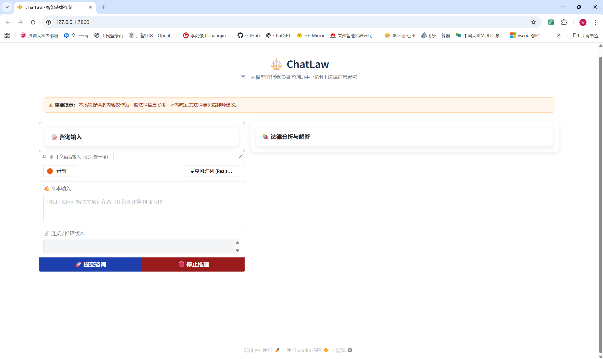
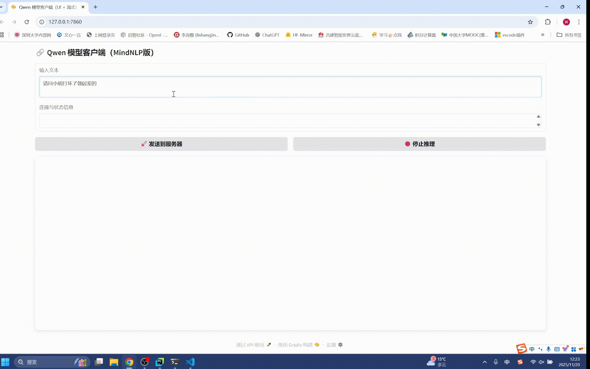

<div align="center">

# ChatLaw


</div>

---

## 📑 目录

- [项目介绍](#项目介绍)
  - [🌐 模型推理技术路线](#-模型推理技术路线)
  - [💻 客户端--服务端平台支持](#-客户端--服务端平台支持)
- [软件架构](#软件架构)
  - [1 项目目录（随项目开发更新）](#1项目目录随项目开发更新)
  - [2 项目结构图](#2项目结构图)
  - [3 主要开发工具](#3主要开发工具)
- [安装教程](#安装教程)
  - [1 安装Anaconda3](#1-安装anaconda3)
  - [2 安装Git](#2-安装git)
  - [3 安装ChatLaw](#3-安装chatlaw)
- [使用说明](#使用说明)
  - [1 检验是否安装成功](#1-检验是否安装成功)
  - [2 使用前准备](#2-使用前准备)
    - [2.1 客户端准备](#21-客户端准备)
    - [2.2 服务端准备](#22-服务端准备)
  - [3 启动方法](#3-启动方法)
    - [3.1 客户端启动方法](#31-客户端启动方法)
    - [3.2 服务端启动方法](#32-服务端启动方法)
  - [4 使用演示](#4使用演示)
  - [5 数据清理](#5数据清理)
- [卸载方法](#卸载方法)
- [参与贡献](#参与贡献)
- [其他说明](#其他说明)

___

## 项目介绍

**ChatLaw** 是一款跨平台的智能法律咨询系统，基于 **Qwen3 大语言模型** 和 **C/S（Client/Server）架构** 设计。系统通过客户端与服务端协同工作，实现语音输入、法律知识检索与大模型推理等核心能力。

在 **客户端**，用户可通过麦克风进行语音提问。客户端负责完成语音识别、知识库检索、文本向量化等前置处理，并对服务端返回的推理结果进行解码和流式展示。

在 **服务端**，系统接收来自客户端的输入，调用大模型执行推理任务，并将生成结果实时回传，实现高效、低延迟的交互体验。

**ChatLaw** 通过模块化设计，构建了集 **语音输入、知识检索、向量化处理、大模型推理、流式传输** 为一体的完整流程，为用户提供便捷且准确的法律咨询服务。

### 🌐 模型推理技术路线

**ChatLaw** 提供两条可自由选择的推理技术路线：

- **MindSpore 技术路线**：使用 MindSpore + MindNLP；
- **PyTorch 技术路线**：使用 PyTorch + Transformers。

两条路线均可在 **GPU** 和 **昇腾 NPU** 上运行，用户可根据使用习惯、依赖环境或部署需求灵活部署。

---

### 💻 客户端 / 服务端平台支持

| 组件类型 | 支持平台 / 系统 | 支持的推理框架 | 支持的硬件后端 |
|----------|------------------|------------------|------------------|
| **客户端** | Windows / Linux / macOS | 无（不执行推理） | 无（不执行推理） |
| **服务端** | **Linux（必需）** | MindSpore / PyTorch | GPU / 昇腾 NPU |

客户端主要负责语音输入、检索与展示，不涉及 AI 加速；
服务端承担大模型推理，可自由选择推理框架与硬件后端组合。

---

## 软件架构
### 1.项目目录（随项目开发更新）
```

```
### 2.项目结构图
<p align="center">
  
</p>

### 3.主要开发工具
| 行项 / 技术方向     | 昇腾技术路线                     | Pytorch 技术路线              |
|----------------------|----------------------------------|-------------------------------|
| **深度学习框架**     | MindSpore                        | PyTorch                       |
| **大模型套件**       | MindNLP                          | Transformers                  |
| **语音输入模块**     | Vosk API（Python Bindings）      | Vosk API（Python Bindings）   |
| **RAG 模块构建**     | LangChain                        | LangChain                     |
| **客户端 UI 构建**   | Gradio                           | Gradio                        |

---

## 安装教程

### 1.  安装Anaconda3
 **以下两种方法二选一：** 

Anaconda3官方下载地址：https://www.anaconda.com/download 根据用户操作系统进行安装

清华镜像源下载地址：https://mirrors.tuna.tsinghua.edu.cn/anaconda/archive/ 根据用户操作系统选择合适的版本进行安装

安装完成后，创建Python版本为3.9-3.11的conda环境

```
conda create -n myenv python=3.11  # 这里以创建Python3.11的环境为例，"myenv"可换成其他名称
```

### 2. 安装Git

 **对于Windows：** 

Git官方下载地址：https://git-scm.com/downloads  选择Windows版进行安装（速度极慢，不推荐）

清华镜像源下载地址：https://mirrors.tuna.tsinghua.edu.cn/github-release/git-for-windows/git/Git%20for%20Windows%20v2.48.1.windows.1 选择合适的版本进行安装（速度较快，推荐）

 **对于linux**

输入如下命令：

```
sudo apt update
sudo apt install git
```
 **对于Mac** 

输入如下命令

```
brew -v
/bin/bash -c "$(curl -fsSL https://raw.githubusercontent.com/Homebrew/install/HEAD/install.sh)"
brew install git
```

### 3. 安装ChatLaw

输入如下命令：

```
git clone https://gitee.com/lishangjing2024/ChatLaw.git
cd ChatLaw
conda activate myenv  # "myenv"是希望安装本项目的环境
pip install .
```

以上命令也可简化为：
```
conda activate myenv
pip install git+https://gitee.com/lishangjing2024/ChatLaw.git
```

 _注意：本安装方式客户端与服务端通用，但服务端要求有GPU或Ascend（昇腾芯片）后端支持，否则无法正常使用_ 

---

## 使用说明

### 1.  检验是否安装成功

命令行输入
```
conda activate myenv  # 激活安装本项目的conda环境，若已激活则忽略本命令
chatlaw -h
```

若输出
```
usage: chatlaw [-h] {client,server,clear} ...

ChatLaw 命令行工具

可用指令包括：
  chatlaw client <ms|pt> [其他参数]    启动客户端模式
  chatlaw server <ms|pt> [其他参数]    启动服务端模式
  chatlaw clear                 清理 resources 文件夹

说明：
  - ms  表示使用MindNLP版本
  - pt  表示使用Transformers版本
  - clear 会在删除前执行交互式确认

positional arguments:
  {client,server,clear}

options:
  -h, --help            show this help message and exit
```
则安装成功

### 2.使用前准备
_说明：本项目的客户与服务器为一对一关系，组网基于私有地址；以下说明基于私有地址的组网方法，方法不唯一，仅作参考_

#### 2.1 客户端准备
_注意：本操作会导致以太网无法访问公网，仅能通过WLAN联网，恢复方法已写在在配置方法下方。_
##### Windows客户端配置静态IP地址
1. 打开设置
2. 选择**网络和Internet**
3. 选择**高级网络设置**
4. 选择**以太网**
5. 选择**Internet协议版本4（TCP/IPv4）**
6. 选择**使用下面的地址**，IP地址设为**192.168.137.101**，子网掩码设置**255.255.255.0**

_恢复方法：把"**使用下面的地址**"改回"**自动获得IP地址**"即可_

##### Linux客户端配置静态IP地址
运行ChatLaw/scripts目录下的static_ip_linux_client.sh脚本即可

_恢复方法：运行ChatLaw/scripts目录下的dhcp_linux_client.sh脚本即可_

##### Mac客户端配置静态IP地址
运行ChatLaw/scripts目录下的static_ip_mac_client.sh脚本即可

_恢复方法：运行ChatLaw/scripts目录下的dhcp_mac_client.sh脚本即可，gateway报错不用理会，DHCP协议会自动配置网关_

#### 2.2 服务端准备
运行ChatLaw/scripts目录下的static_ip_linux_server.sh脚本为服务器配置静态IP。

_注意：配置后服务器将无法通过以太网口访问外网。恢复方法为运行ChatLaw/scripts目录下的dhcp_linux_server.sh脚本即可_

### 3.启动方法
#### 3.1 客户端启动方法
命令行输入
```
conda activate myenv  # 激活安装本项目的conda环境，若已激活则忽略本命令
chatlaw client ms  # 启动MindSpore + MindNLP实现模型推理的客户端
```
或输入
```
conda activate myenv  # 激活安装本项目的conda环境，若已激活则忽略本命令
chatlaw client pt  # 启动Pytorch + Transformers实现模型推理的客户端
```
等待片刻后，若浏览器显示如下界面：
<p align="center">
  
</p>

则客户端启动成功

 _注意：本模块初次启动需要下载知识库和语音模型文件，故初次启动较慢_ 

#### 3.2 服务端启动方法
命令行输入
```
conda activate myenv  # 激活安装本项目的conda环境，若已激活则忽略本命令
chatlaw server ms  # 服务端使用MindSpore + MindNLP实现模型推理
```
或输入
```
conda activate myenv  # 激活安装本项目的conda环境，若已激活则忽略本命令
chatlaw server pt  # 服务端使用Pytorch + Transformers实现模型推理
```
若命令行输出
```

```
则服务端启动成功

 _注意：本模块初次启动需要下载知识库和语音模型文件，故初次启动较慢_ 

### 4.使用演示

UI中输入文本（目前尚未嵌入语音模块），按下**🚀发送到服务器**，若状态栏无异常，输出区域有文本流式输入，则运行成功：
<p align="center">
  
</p>

### 5.数据清理
命令行输入
```
conda activate myenv  # 激活安装本项目的conda环境，若已激活则忽略本命令
chawlaw clear  # 清除所有模型文件数据
```
___
## 卸载方法
命令行输入
```
conda activate myenv  # 激活安装本项目的conda环境，若已激活则忽略本命令
pip uninstall chatlaw  # 卸载ChatLaw
```
_注意：上述命令不会将已下载的模型等文件一并删除，因此在卸载前请执行清除数据命令_


## 参与贡献

1.  Fork 本仓库
2.  新建 Feat_xxx 分支
3.  提交代码
4.  新建 Pull Request

---

## 其他说明

联系人：李尚憬

联系邮箱: 1755397894@qq.com

启智社区个人主页：https://openi.pcl.ac.cn/enter (本项目所用数据集和模型均托管于此)

